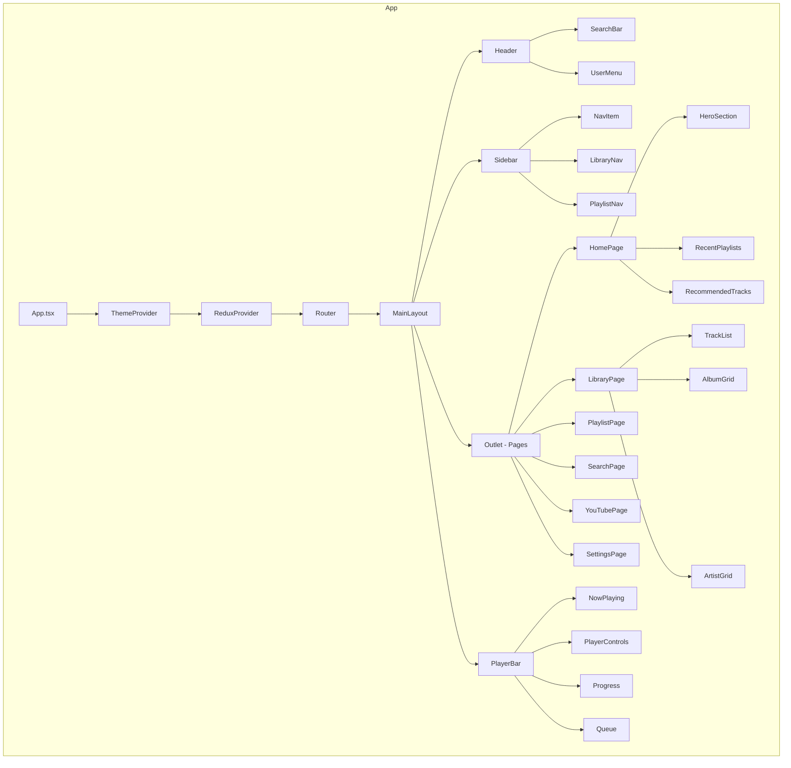
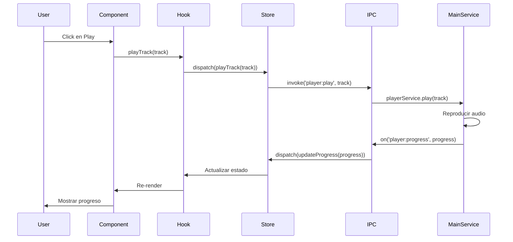
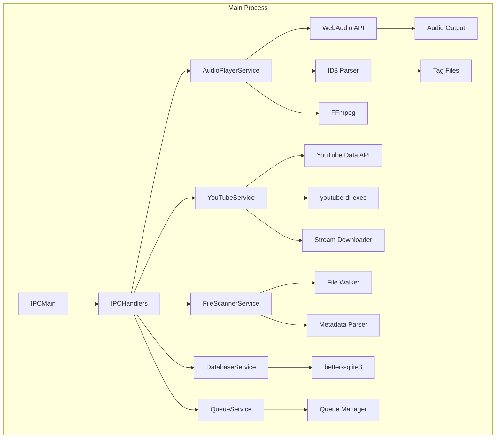
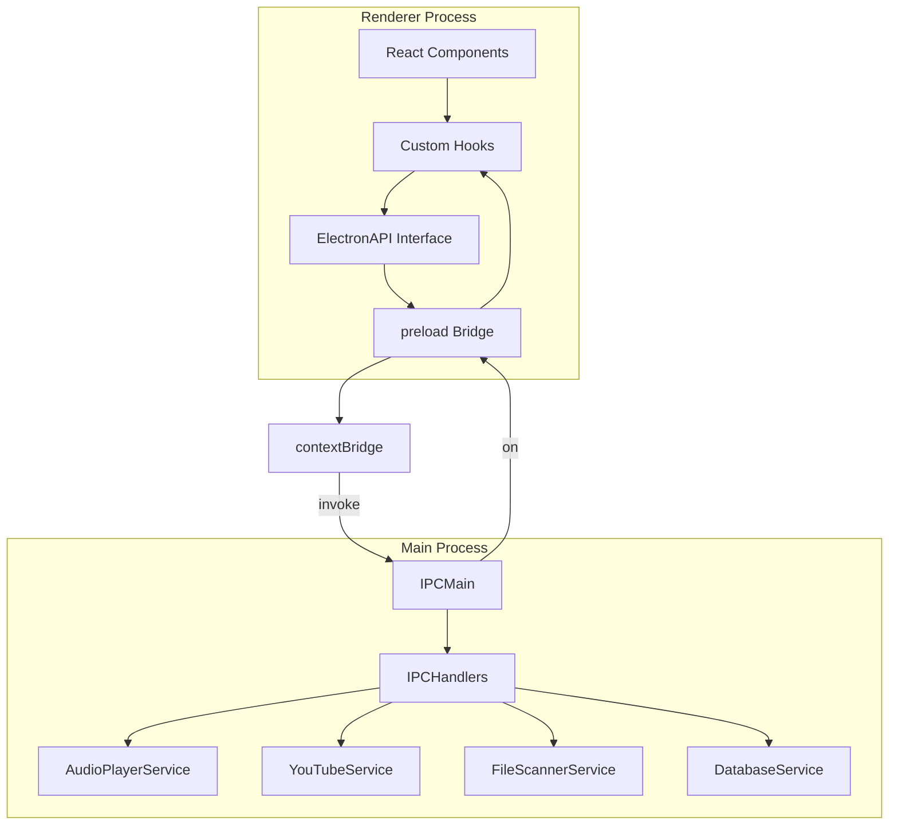
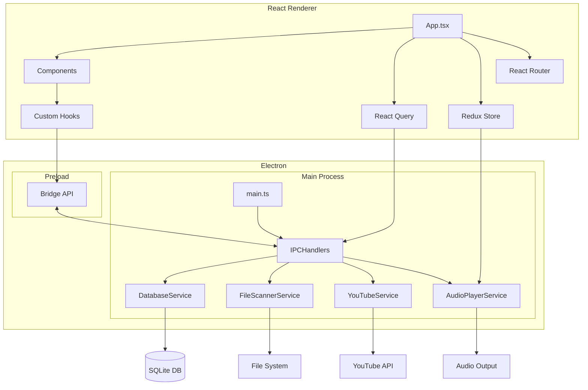

# Diseño Arquitectónico - MusicPlayer

## 📋 Resumen Ejecutivo

Este documento presenta el diseño técnico completo para la aplicación MusicPlayer, un reproductor de música similar a Spotify con capacidades de reproducción de música local y YouTube. El diseño sigue una arquitectura moderna basada en **Electron + React + TypeScript** con separación clara de responsabilidades entre el proceso principal de Electron y el proceso de renderizado.

---

## 1. Estructura de Carpetas del Proyecto

### 1.1 Vista General de la Estructura

```
music-player/
├── .electron-vite/                    # Configuración de Electron + Vite
├── release/                           # Builds de distribución
├── scripts/                           # Scripts de build y deployment
├── src/
│   ├── main/                          # Electron Main Process
│   │   ├── main.ts                    # Entry point de Electron
│   │   ├── preload/                   # Preload scripts (Bridge)
│   │   ├── services/                  # Servicios del sistema
│   │   │   ├── audio-player/          # Servicio de reproducción de audio local
│   │   │   ├── youtube-service/       # Servicio de YouTube
│   │   │   ├── file-scanner/          # Scanner de archivos de música
│   │   │   ├── database/              # Servicio de base de datos SQLite
│   │   │   └── ipc-handlers/          # Handlers de comunicación IPC
│   │   ├── utils/                     # Utilidades del main process
│   │   └── config/                    # Configuración de la aplicación
│   ├── renderer/                      # React Renderer Process
│   │   ├── src/
│   │   │   ├── components/            # Componentes React
│   │   │   │   ├── common/            # Componentes reutilizables
│   │   │   │   ├── layout/            # Componentes de layout
│   │   │   │   ├── player/            # Componentes del reproductor
│   │   │   │   ├── library/           # Componentes de biblioteca
│   │   │   │   ├── playlist/          # Componentes de playlists
│   │   │   │   ├── search/            # Componentes de búsqueda
│   │   │   │   ├── youtube/           # Componentes de YouTube
│   │   │   │   └── settings/          # Componentes de configuración
│   │   │   ├── hooks/                 # Custom React Hooks
│   │   │   ├── stores/                # Redux stores y slices
│   │   │   ├── services/              # Servicios del renderer
│   │   │   ├── pages/                 # Páginas de la aplicación
│   │   │   ├── utils/                 # Utilidades del renderer
│   │   │   ├── theme/                 # Configuración del tema MUI
│   │   │   ├── types/                 # Tipos TypeScript
│   │   │   ├── assets/                # Assets estáticos
│   │   │   └── App.tsx                # Componente principal
│   │   ├── index.html                 # HTML template
│   │   └── vite.config.ts             # Configuración de Vite
│   ├── shared/                        # Código compartido (main + renderer)
│   │   ├── types/                     # Tipos TypeScript compartidos
│   │   ├── constants/                 # Constantes compartidas
│   │   └── utils/                     # Utilidades compartidas
│   └── common/                        # Tipos y constantes globales
├── tests/                             # Tests unitarios y de integración
├── database/                          # Base de datos SQLite
├── resources/                         # Recursos de la aplicación
│   ├── icons/                         # Iconos de la aplicación
│   └── sounds/                        # Sonidos de UI
├── .env                               # Variables de entorno
├── .eslintrc.cjs                      # Configuración ESLint
├── .prettierrc.cjs                    # Configuración Prettier
├── package.json                       # Dependencias y scripts
├── tsconfig.json                      # Configuración TypeScript
├── vite.config.ts                     # Configuración Vite
└── electron-builder.config.json       # Configuración Electron Builder
```

### 1.2 Justificación de la Estructura

La estructura de carpetas está organizada siguiendo principios de **Domain-Driven Design (DDD)** y **Separation of Concerns**:

- **`src/main/`**: Código del proceso principal de Electron, aislado del renderer para seguridad
- **`src/renderer/`**: Código del proceso de renderizado con React
- **`src/shared/`**: Código común que puede ejecutarse en ambos procesos
- **`src/common/`**: Tipos y constantes globales accesibles en toda la aplicación

Esta separación permite:
- **Aislamiento de procesos**: El main process maneja operaciones del sistema, el renderer maneja la UI
- **Reutilización de código**: Tipos y utilidades compartidas entre procesos
- **Mantenibilidad**: Cada directorio tiene una responsabilidad clara
- **Escalabilidad**: La estructura permite agregar nuevas features sin reorganizar

### 1.3 Estructura Detallada de Componentes

```
src/renderer/src/components/
├── common/                    # Componentes atómicos reutilizables
│   ├── Button/               # Botones personalizados
│   │   ├── index.tsx
│   │   ├── Button.styles.ts
│   │   └── Button.types.ts
│   ├── IconButton/           # Botones con iconos
│   ├── Input/                # Campos de texto
│   ├── Modal/                # Modales reutilizables
│   ├── Dropdown/             # Menús desplegables
│   ├── Tooltip/              # Tooltips
│   ├── ProgressBar/          # Barras de progreso
│   ├── Slider/               # Controles deslizantes
│   ├── Switch/               # Interruptores
│   ├── Card/                 # Tarjetas
│   ├── List/                 # Listas
│   ├── Table/                # Tablas de datos
│   ├── Avatar/               # Avatares de artistas
│   ├── Badge/                # Etiquetas y badges
│   ├── Chip/                 # Chips/tags
│   ├── Loading/              # Componentes de carga
│   │   ├── Spinner.tsx
│   │   ├── Skeleton.tsx
│   │   └── FullPageLoader.tsx
│   └── Toast/                # Notificaciones toast
│
├── layout/                   # Componentes de estructura
│   ├── Sidebar/              # Barra lateral de navegación
│   │   ├── index.tsx
│   │   ├── Sidebar.styles.ts
│   │   └── Sidebar.types.ts
│   ├── Header/               # Cabecera de la aplicación
│   ├── MainLayout/           # Layout principal con sidebar
│   ├── PlayerBar/            # Barra del reproductor (fija abajo)
│   ├── Navigation/           # Componentes de navegación
│   └── SplitView/            # Vista dividida (lista + detalle)
│
├── player/                   # Componentes del reproductor
│   ├── PlayerControls/       # Controles de reproducción
│   │   ├── PlayPauseButton.tsx
│   │   ├── SkipForward.tsx
│   │   ├── SkipBackward.tsx
│   │   ├── ShuffleButton.tsx
│   │   ├── RepeatButton.tsx
│   │   └── VolumeControl.tsx
│   ├── Progress/             # Progreso de reproducción
│   │   ├── ProgressBar.tsx
│   │   ├── TimeDisplay.tsx
│   │   └── SeekSlider.tsx
│   ├── Queue/                # Cola de reproducción
│   │   ├── QueueList.tsx
│   │   ├── QueueItem.tsx
│   │   └── QueueManager.tsx
│   ├── Equalizer/            # Ecualizador
│   │   ├── Equalizer.tsx
│   │   ├── EqualizerBand.tsx
│   │   └── EqualizerPresets.tsx
│   ├── NowPlaying/           # Información de reproducción actual
│   │   ├── TrackInfo.tsx
│   │   ├── AlbumArt.tsx
│   │   └── TrackActions.tsx
│   └── MiniPlayer/           # Versión mini del reproductor
│
├── library/                  # Componentes de biblioteca musical
│   ├── TrackList/            # Lista de canciones
│   │   ├── TrackRow.tsx
│   │   ├── TrackList.tsx
│   │   └── TrackListHeader.tsx
│   ├── AlbumGrid/            # Grid de álbumes
│   │   ├── AlbumCard.tsx
│   │   └── AlbumGrid.tsx
│   ├── ArtistGrid/           # Grid de artistas
│   │   ├── ArtistCard.tsx
│   │   └── ArtistGrid.tsx
│   ├── FolderBrowser/        # Explorador de carpetas
│   │   ├── FolderTree.tsx
│   │   └── FolderItem.tsx
│   ├── GenreList/            # Lista por géneros
│   └── LibraryStats/         # Estadísticas de la biblioteca
│
├── playlist/                 # Componentes de playlists
│   ├── PlaylistCard/         # Tarjeta de playlist
│   ├── PlaylistHeader/       # Cabecera de playlist
│   ├── PlaylistTracks/       # Lista de canciones de playlist
│   ├── CreatePlaylist/       # Modal de creación
│   ├── EditPlaylist/         # Modal de edición
│   └── PlaylistMenu/         # Menú contextual
│
├── search/                   # Componentes de búsqueda
│   ├── SearchBar/            # Barra de búsqueda
│   ├── SearchResults/        # Resultados de búsqueda
│   ├── SearchFilters/        # Filtros de búsqueda
│   └── SearchHistory/        # Historial de búsquedas
│
├── youtube/                  # Componentes de YouTube
│   ├── YouTubeSearch/        # Búsqueda en YouTube
│   ├── YouTubePlayer/        # Reproductor de video
│   ├── YouTubeCard/          # Tarjeta de video
│   ├── YouTubePlaylist/      # Playlist de YouTube
│   └── LiveStreamPlayer/     # Reproductor de streams en vivo
│
└── settings/                 # Componentes de configuración
    ├── General/              # Configuración general
    ├── Audio/                # Configuración de audio
    ├── Library/              # Configuración de biblioteca
    ├── Theme/                # Configuración de tema
    ├── Shortcuts/            # Atajos de teclado
    └── About/                # Acerca de
```

---

## 2. Arquitectura de Componentes React

### 2.1 Jerarquía de Componentes



### 2.2 Patrones de Diseño Utilizados

#### 2.2.1 Compound Components Pattern
```typescript
// Ejemplo: Componentes compuestos para el reproductor
interface PlayerControlsProps {
  children: React.ReactNode;
}

export const PlayerControls: React.FC<PlayerControlsProps> & {
  Play: typeof PlayButton;
  Skip: typeof SkipButton;
  Volume: typeof VolumeControl;
  Shuffle: typeof ShuffleButton;
  Repeat: typeof RepeatButton;
} = ({ children }) => {
  return <div className="player-controls">{children}</div>;
};

PlayerControls.Play = PlayButton;
PlayerControls.Skip = SkipButton;
PlayerControls.Volume = VolumeControl;
PlayerControls.Shuffle = ShuffleButton;
PlayerControls.Repeat = RepeatButton;
```

#### 2.2.2 Custom Hooks Pattern
```typescript
// Ejemplo: Hook personalizado para el reproductor
export const usePlayer = () => {
  const dispatch = useAppDispatch();
  const { currentTrack, isPlaying, queue } = useAppSelector(selectPlayerState);
  
  const play = useCallback((track: Track) => {
    dispatch(playTrack(track));
  }, [dispatch]);
  
  const pause = useCallback(() => {
    dispatch(pauseTrack());
  }, [dispatch]);
  
  const togglePlay = useCallback(() => {
    if (isPlaying) pause();
    else play(currentTrack);
  }, [isPlaying, pause, play, currentTrack]);
  
  return { play, pause, togglePlay, currentTrack, isPlaying, queue };
};
```

#### 2.2.3 Presentational vs Container Components
```typescript
// Presentational Component - Solo presentación
interface TrackRowProps {
  track: Track;
  isPlaying: boolean;
  onPlay: (track: Track) => void;
}

export const TrackRow: React.FC<TrackRowProps> = ({
  track,
  isPlaying,
  onPlay
}) => {
  return (
    <TableRow onClick={() => onPlay(track)}>
      <TableCell>
        {isPlaying ? <PlayingIcon /> : <span>{track.number}</span>}
      </TableCell>
      <TableCell>{track.title}</TableCell>
      <TableCell>{track.artist}</TableCell>
      <TableCell>{formatDuration(track.duration)}</TableCell>
    </TableRow>
  );
};

// Container Component - Lógica y estado
export const TrackListContainer: React.FC<TrackListProps> = ({ tracks }) => {
  const { currentTrack, isPlaying, play } = usePlayer();
  
  return (
    <Table>
      <TableHead>...</TableHead>
      <TableBody>
        {tracks.map(track => (
          <TrackRow
            key={track.id}
            track={track}
            isPlaying={currentTrack?.id === track.id && isPlaying}
            onPlay={play}
          />
        ))}
      </TableBody>
    </Table>
  );
};
```

#### 2.2.4 Render Props Pattern
```typescript
// Ejemplo: Componente de carga con render props
interface AsyncDataProps<T> {
  loader: () => Promise<T>;
  children: (data: T | null, loading: boolean, error: Error | null) => React.ReactNode;
  fallback?: React.ReactNode;
}

export const AsyncData = <T,>({ loader, children, fallback }: AsyncDataProps<T>) => {
  const { data, loading, error } = useAsync(loader);
  
  if (loading) return fallback || <LoadingSpinner />;
  if (error) return <ErrorMessage error={error} />;
  
  return <>{children(data, loading, error)}</>;
};
```

### 2.3 Flujo de Datos en Componentes



---

## 3. Modelo de Datos (SQLite Schema)

### 3.1 Esquema de Base de Datos

```sql
-- =============================================
-- MusicPlayer Database Schema
-- =============================================

-- Configuración de la aplicación
CREATE TABLE IF NOT EXISTS settings (
    key TEXT PRIMARY KEY,
    value TEXT NOT NULL,
    updated_at DATETIME DEFAULT CURRENT_TIMESTAMP
);

-- Tablas de metadatos de música
CREATE TABLE IF NOT EXISTS artists (
    id TEXT PRIMARY KEY,
    name TEXT NOT NULL,
    image_path TEXT,
    bio TEXT,
    genres TEXT,
    created_at DATETIME DEFAULT CURRENT_TIMESTAMP,
    updated_at DATETIME DEFAULT CURRENT_TIMESTAMP,
    UNIQUE(name)
);

CREATE TABLE IF NOT EXISTS albums (
    id TEXT PRIMARY KEY,
    name TEXT NOT NULL,
    artist_id TEXT,
    release_year INTEGER,
    cover_path TEXT,
    genre TEXT,
    created_at DATETIME DEFAULT CURRENT_TIMESTAMP,
    updated_at DATETIME DEFAULT CURRENT_TIMESTAMP,
    FOREIGN KEY (artist_id) REFERENCES artists(id),
    UNIQUE(name, artist_id)
);

CREATE TABLE IF NOT EXISTS tracks (
    id TEXT PRIMARY KEY,
    title TEXT NOT NULL,
    artist_id TEXT,
    album_id TEXT,
    file_path TEXT NOT NULL,
    duration INTEGER NOT NULL,
    track_number INTEGER,
    disc_number INTEGER,
    file_size INTEGER,
    bitrate INTEGER,
    sample_rate INTEGER,
    format TEXT,
    genre TEXT,
    year INTEGER,
    date_added DATETIME DEFAULT CURRENT_TIMESTAMP,
    last_played DATETIME,
    play_count INTEGER DEFAULT 0,
    is_favorite INTEGER DEFAULT 0,
    lyrics TEXT,
    FOREIGN KEY (artist_id) REFERENCES artists(id),
    FOREIGN KEY (album_id) REFERENCES albums(id)
);

CREATE TABLE IF NOT EXISTS genres (
    id INTEGER PRIMARY KEY AUTOINCREMENT,
    name TEXT NOT NULL UNIQUE,
    track_count INTEGER DEFAULT 0
);

-- Playlists
CREATE TABLE IF NOT EXISTS playlists (
    id TEXT PRIMARY KEY,
    name TEXT NOT NULL,
    description TEXT,
    cover_path TEXT,
    is_smart INTEGER DEFAULT 0,
    is_system INTEGER DEFAULT 0,
    created_at DATETIME DEFAULT CURRENT_TIMESTAMP,
    updated_at DATETIME DEFAULT CURRENT_TIMESTAMP,
    sort_order TEXT DEFAULT 'custom'
);

CREATE TABLE IF NOT EXISTS playlist_tracks (
    playlist_id TEXT NOT NULL,
    track_id TEXT NOT NULL,
    position INTEGER NOT NULL,
    added_at DATETIME DEFAULT CURRENT_TIMESTAMP,
    PRIMARY KEY (playlist_id, track_id),
    FOREIGN KEY (playlist_id) REFERENCES playlists(id) ON DELETE CASCADE,
    FOREIGN KEY (track_id) REFERENCES tracks(id) ON DELETE CASCADE
);

-- smart playlists
CREATE TABLE IF NOT EXISTS smart_playlists (
    id TEXT PRIMARY KEY,
    playlist_id TEXT NOT NULL,
    rule_type TEXT NOT NULL,
    rule_operator TEXT NOT NULL,
    rule_value TEXT NOT NULL,
    sort_by TEXT,
    sort_order TEXT,
    limit_count INTEGER,
    FOREIGN KEY (playlist_id) REFERENCES playlists(id) ON DELETE CASCADE
);

-- Historial de reproducción
CREATE TABLE IF NOT EXISTS playback_history (
    id INTEGER PRIMARY KEY AUTOINCREMENT,
    track_id TEXT NOT NULL,
    started_at DATETIME DEFAULT CURRENT_TIMESTAMP,
    completed INTEGER DEFAULT 0,
    progress INTEGER DEFAULT 0,
    FOREIGN KEY (track_id) REFERENCES tracks(id)
);

CREATE TABLE IF NOT EXISTS recently_played (
    track_id TEXT PRIMARY KEY,
    last_played DATETIME DEFAULT CURRENT_TIMESTAMP,
    play_count INTEGER DEFAULT 0,
    FOREIGN KEY (track_id) REFERENCES tracks(id)
);

-- Bibliotecas/carpetas monitoreadas
CREATE TABLE IF NOT EXISTS libraries (
    id TEXT PRIMARY KEY,
    name TEXT NOT NULL,
    path TEXT NOT NULL,
    scan_depth INTEGER DEFAULT -1,
    file_types TEXT DEFAULT 'mp3,wav,flac,aac,ogg,m4a',
    is_active INTEGER DEFAULT 1,
    last_scan DATETIME,
    created_at DATETIME DEFAULT CURRENT_TIMESTAMP
);

CREATE TABLE IF NOT EXISTS excluded_paths (
    id INTEGER PRIMARY KEY AUTOINCREMENT,
    path TEXT NOT NULL UNIQUE
);

-- YouTube
CREATE TABLE IF NOT EXISTS youtube_cache (
    id TEXT PRIMARY KEY,
    type TEXT NOT NULL,
    title TEXT NOT NULL,
    thumbnail_url TEXT,
    channel_name TEXT,
    duration TEXT,
    url TEXT NOT NULL,
    local_path TEXT,
    downloaded_at DATETIME,
    expires_at DATETIME,
    metadata TEXT
);

CREATE TABLE IF NOT EXISTS youtube_playlists (
    id TEXT PRIMARY KEY,
    name TEXT NOT NULL,
    description TEXT,
    thumbnail_url TEXT,
    channel_id TEXT,
    channel_name TEXT,
    video_count INTEGER,
    created_at DATETIME DEFAULT CURRENT_TIMESTAMP,
    updated_at DATETIME DEFAULT CURRENT_TIMESTAMP
);

CREATE TABLE IF NOT EXISTS youtube_playlist_videos (
    id TEXT PRIMARY KEY,
    playlist_id TEXT NOT NULL,
    video_id TEXT NOT NULL,
    position INTEGER NOT NULL,
    added_at DATETIME DEFAULT CURRENT_TIMESTAMP,
    FOREIGN KEY (playlist_id) REFERENCES youtube_playlists(id) ON DELETE CASCADE,
    FOREIGN KEY (video_id) REFERENCES youtube_cache(id)
);

-- Cola de reproducción
CREATE TABLE IF NOT EXISTS play_queue (
    id INTEGER PRIMARY KEY AUTOINCREMENT,
    track_id TEXT NOT NULL,
    position INTEGER NOT NULL,
    source_type TEXT,
    source_id TEXT,
    added_at DATETIME DEFAULT CURRENT_TIMESTAMP,
    FOREIGN KEY (track_id) REFERENCES tracks(id)
);

-- Índices para optimización de consultas
CREATE INDEX IF NOT EXISTS idx_tracks_artist ON tracks(artist_id);
CREATE INDEX IF NOT EXISTS idx_tracks_album ON tracks(album_id);
CREATE INDEX IF NOT EXISTS idx_tracks_genre ON tracks(genre);
CREATE INDEX IF NOT EXISTS idx_tracks_favorite ON tracks(is_favorite);
CREATE INDEX IF NOT EXISTS idx_tracks_date_added ON tracks(date_added);
CREATE INDEX IF NOT EXISTS idx_tracks_last_played ON tracks(last_played);
CREATE INDEX IF NOT EXISTS idx_playlist_tracks_playlist ON playlist_tracks(playlist_id);
CREATE INDEX IF NOT EXISTS idx_playback_history_track ON playback_history(track_id);
CREATE INDEX IF NOT EXISTS idx_recently_played ON recently_played(last_played DESC);
CREATE INDEX IF NOT EXISTS idx_youtube_cache_type ON youtube_cache(type);
```

### 3.2 Funciones y Triggers

```sql
-- Trigger para actualizar play_count en tracks
CREATE TRIGGER IF NOT EXISTS update_play_count
AFTER UPDATE OF last_played ON tracks
BEGIN
    UPDATE tracks SET play_count = play_count + 1 WHERE id = NEW.id;
END;

-- Trigger para actualizar count de artistas
CREATE TRIGGER IF NOT EXISTS update_artist_track_count
AFTER INSERT ON tracks
BEGIN
    UPDATE artists SET 
        (SELECT COUNT(*) FROM tracks WHERE artist_id = NEW.artist_id)
    WHERE id = NEW.artist_id;
END;

-- Función para buscar tracks
CREATE VIRTUAL TABLE IF NOT EXISTS tracks_search USING fts5(
    title,
    artist,
    album,
    genre,
    content='',
    content_rowid='id'
);

-- Trigger para mantener índice de búsqueda
CREATE TRIGGER IF NOT EXISTS tracks_ai AFTER INSERT ON tracks BEGIN
    INSERT INTO tracks_search(rowid, title, artist, album, genre)
    VALUES (NEW.id, NEW.title, NEW.artist_id, NEW.album_id, NEW.genre);
END;
```

---

## 4. Servicios del Sistema

### 4.1 Arquitectura de Servicios



### 4.2 Servicio de Scanner de Archivos

```typescript
// src/main/services/file-scanner/scanner.service.ts
interface ScannerService {
  // Iniciar escaneo completo
  scanLibrary(libraryId: string): Promise<ScanResult>;
  
  // Escaneo incremental
  incrementalScan(libraryId: string): Promise<ScanResult>;
  
  // Cancelar escaneo en progreso
  cancelScan(): void;
  
  // Obtener estado del escaneo
  getScanStatus(): ScanStatus;
  
  // Escanear un archivo individual
  scanFile(filePath: string): Promise<TrackMetadata | null>;
}

interface ScanResult {
  totalFiles: number;
  scannedFiles: number;
  addedTracks: number;
  updatedTracks: number;
  removedTracks: number;
  errors: ScanError[];
  duration: number;
}

interface ScanStatus {
  isScanning: boolean;
  progress: number;
  currentPath: string;
  currentFile: string;
  startTime: Date | null;
}

// Implementación del escáner
class FileScannerService implements ScannerService {
  private isCancelled = false;
  private eventEmitter: EventEmitter;
  private metadataParser: MetadataParser;
  private db: DatabaseService;
  
  async scanLibrary(libraryId: string): Promise<ScanResult> {
    const library = await this.db.getLibrary(libraryId);
    if (!library) throw new Error('Library not found');
    
    this.isCancelled = false;
    const startTime = Date.now();
    
    const fileTypes = library.file_types.split(',');
    const files = await this.walkDirectory(library.path, fileTypes);
    
    const result: ScanResult = {
      totalFiles: files.length,
      scannedFiles: 0,
      addedTracks: 0,
      updatedTracks: 0,
      removedTracks: 0,
      errors: [],
      duration: 0,
    };
    
    // Detectar archivos eliminados
    const existingFiles = await this.db.getAllFilePaths();
    const currentFiles = new Set(files.map(f => f.path));
    const deletedFiles = existingFiles.filter(f => !currentFiles.has(f));
    
    for (const file of deletedFiles) {
      await this.db.softDeleteTrack(file.path);
      result.removedTracks++;
    }
    
    // Escanear archivos nuevos/modificados
    for (const file of files) {
      if (this.isCancelled) break;
      
      try {
        const metadata = await this.scanFile(file.path);
        if (metadata) {
          const existing = await this.db.getTrackByPath(file.path);
          if (existing) {
            await this.db.updateTrack(existing.id, metadata);
            result.updatedTracks++;
          } else {
            await this.db.addTrack(metadata);
            result.addedTracks++;
          }
        }
        result.scannedFiles++;
        
        // Emitir progreso
        this.eventEmitter.emit('scan:progress', {
          current: result.scannedFiles,
          total: result.totalFiles,
          currentFile: file.path,
        });
      } catch (error) {
        result.errors.push({
          file: file.path,
          error: error.message,
        });
      }
    }
    
    result.duration = Date.now() - startTime;
    await this.db.updateLibraryLastScan(libraryId);
    
    return result;
  }
  
  async scanFile(filePath: string): Promise<TrackMetadata | null> {
    try {
      const metadata = await this.metadataParser.parse(filePath);
      
      // Asegurar que el artista existe
      let artist = await this.db.getArtistByName(metadata.artist);
      if (!artist && metadata.artist) {
        artist = await this.db.addArtist({
          id: generateId(),
          name: metadata.artist,
        });
      }
      
      // Asegurar que el álbum existe
      let album = await this.db.getAlbumByTitle(metadata.album);
      if (!album && metadata.album) {
        album = await this.db.addAlbum({
          id: generateId(),
          name: metadata.album,
          artist_id: artist?.id,
          release_year: metadata.year,
        });
      }
      
      return {
        id: generateId(),
        title: metadata.title || path.basename(filePath, path.extname(filePath)),
        artist_id: artist?.id,
        album_id: album?.id,
        file_path: filePath,
        duration: metadata.duration,
        track_number: metadata.trackNumber,
        disc_number: metadata.discNumber,
        file_size: metadata.size,
        bitrate: metadata.bitrate,
        sample_rate: metadata.sampleRate,
        format: metadata.format,
        genre: metadata.genre,
        year: metadata.year,
        date_added: new Date(),
      };
    } catch (error) {
      console.error(`Error scanning file ${filePath}:`, error);
      return null;
    }
  }
  
  private async walkDirectory(
    dir: string,
    allowedExtensions: string[]
  ): Promise<Array<{ path: string; mtime: Date }>> {
    const files: Array<{ path: string; mtime: Date }> = [];
    
    const walk = async (currentDir: string) => {
      const entries = await fs.promises.readdir(currentDir, { withFileTypes: true });
      
      for (const entry of entries) {
        const fullPath = path.join(currentDir, entry.name);
        
        if (entry.isDirectory()) {
          // Verificar si está en lista de exclusión
          const relativePath = path.relative(dir, fullPath);
          const isExcluded = await this.db.isPathExcluded(relativePath);
          
          if (!isExcluded) {
            await walk(fullPath);
          }
        } else if (entry.isFile()) {
          const ext = path.extname(entry.name).toLowerCase().slice(1);
          if (allowedExtensions.includes(ext)) {
            const stat = await fs.promises.stat(fullPath);
            files.push({ path: fullPath, mtime: stat.mtime });
          }
        }
      }
    };
    
    await walk(dir);
    return files;
  }
}
```

### 4.3 Servicio de Reproducción de Audio

```typescript
// src/main/services/audio-player/player.service.ts
interface AudioPlayerService {
  // Control de reproducción
  play(track: Track): Promise<void>;
  pause(): Promise<void>;
  resume(): Promise<void>;
  stop(): Promise<void>;
  seek(time: number): Promise<void>;
  
  // Control de volumen
  setVolume(volume: number): void;
  getVolume(): number;
  mute(): void;
  unmute(): void;
  
  // Navegación
  next(): Promise<Track | null>;
  previous(): Promise<Track | null>;
  playAt(index: number): Promise<void>;
  
  // Modo de reproducción
  setShuffle(enabled: boolean): void;
  setRepeat(mode: RepeatMode): void;
  
  // Cola
  setQueue(tracks: Track[]): void;
  addToQueue(track: Track): void;
  clearQueue(): void;
  removeFromQueue(index: number): void;
  
  // Estado
  getState(): PlayerState;
  onStateChange(callback: (state: PlayerState) => void): void;
}

interface PlayerState {
  currentTrack: Track | null;
  isPlaying: boolean;
  currentTime: number;
  duration: number;
  volume: number;
  muted: boolean;
  shuffle: boolean;
  repeat: RepeatMode;
  queue: Track[];
}

type RepeatMode = 'off' | 'all' | 'one';

class AudioPlayerService implements AudioPlayerService {
  private audioContext: AudioContext;
  private audioElement: HTMLAudioElement;
  private gainNode: GainNode;
  private sourceNode: AudioBufferSourceNode | null = null;
  private audioBuffer: AudioBuffer | null = null;
  
  private state: PlayerState;
  private eventEmitter: EventEmitter;
  
  private repeatModes: RepeatMode[] = ['off', 'all', 'one'];
  private currentRepeatIndex = 0;
  private shuffleEnabled = false;
  private queue: Track[] = [];
  private currentIndex = 0;
  
  constructor() {
    this.audioElement = new Audio();
    this.audioContext = new AudioContext();
    this.gainNode = this.audioContext.createGain();
    this.gainNode.connect(this.audioContext.destination);
    
    this.state = {
      currentTrack: null,
      isPlaying: false,
      currentTime: 0,
      duration: 0,
      volume: 1,
      muted: false,
      shuffle: false,
      repeat: 'off',
      queue: [],
    };
    
    this.setupEventListeners();
  }
  
  async play(track: Track): Promise<void> {
    await this.audioContext.resume();
    
    try {
      // Cargar buffer de audio para mejor control
      const response = await fetch(`file://${track.file_path}`);
      const arrayBuffer = await response.arrayBuffer();
      this.audioBuffer = await this.audioContext.decodeAudioData(arrayBuffer);
      
      if (this.sourceNode) {
        this.sourceNode.stop();
      }
      
      this.sourceNode = this.audioContext.createBufferSource();
      this.sourceNode.buffer = this.audioBuffer;
      this.sourceNode.connect(this.gainNode);
      
      this.sourceNode.onended = () => {
        if (this.state.repeat === 'one') {
          this.seek(0);
          this.play(track);
        } else {
          this.handleTrackEnd();
        }
      };
      
      this.sourceNode.start(0, this.state.currentTime);
      this.state.currentTrack = track;
      this.state.isPlaying = true;
      
      this.emitStateChange();
    } catch (error) {
      console.error('Error playing track:', error);
      throw error;
    }
  }
  
  pause(): Promise<void> {
    if (this.audioElement.paused) {
      this.audioElement.play();
      this.state.isPlaying = true;
    } else {
      this.audioElement.pause();
      this.state.isPlaying = false;
    }
    this.emitStateChange();
    return Promise.resolve();
  }
  
  stop(): void {
    if (this.sourceNode) {
      this.sourceNode.stop();
      this.sourceNode = null;
    }
    this.state.currentTrack = null;
    this.state.isPlaying = false;
    this.state.currentTime = 0;
    this.emitStateChange();
  }
  
  async seek(time: number): Promise<void> {
    this.state.currentTime = Math.max(0, Math.min(time, this.state.duration));
    
    if (this.state.currentTrack) {
      if (this.sourceNode && this.audioBuffer) {
        // Para audio cargado en buffer
        this.sourceNode.stop();
        this.sourceNode = this.audioContext.createBufferSource();
        this.sourceNode.buffer = this.audioBuffer;
        this.sourceNode.connect(this.gainNode);
        this.sourceNode.start(0, this.state.currentTime);
        
        this.sourceNode.onended = () => {
          if (this.state.repeat === 'one') {
            this.seek(0);
            this.play(this.state.currentTrack!);
          } else {
            this.handleTrackEnd();
          }
        };
      }
    }
    
    this.emitStateChange();
  }
  
  setVolume(volume: number): void {
    this.state.volume = Math.max(0, Math.min(1, volume));
    this.gainNode.gain.value = this.state.muted ? 0 : this.state.volume;
    this.emitStateChange();
  }
  
  mute(): void {
    this.state.muted = true;
    this.gainNode.gain.value = 0;
    this.emitStateChange();
  }
  
  unmute(): void {
    this.state.muted = false;
    this.gainNode.gain.value = this.state.volume;
    this.emitStateChange();
  }
  
  next(): Promise<Track | null> {
    if (this.queue.length === 0) return Promise.resolve(null);
    
    if (this.shuffleEnabled) {
      this.currentIndex = Math.floor(Math.random() * this.queue.length);
    } else {
      this.currentIndex = (this.currentIndex + 1) % this.queue.length;
    }
    
    const nextTrack = this.queue[this.currentIndex];
    this.play(nextTrack);
    return Promise.resolve(nextTrack);
  }
  
  previous(): Promise<Track | null> {
    if (this.queue.length === 0) return Promise.resolve(null);
    
    this.currentIndex = (this.currentIndex - 1 + this.queue.length) % this.queue.length;
    const prevTrack = this.queue[this.currentIndex];
    this.play(prevTrack);
    return Promise.resolve(prevTrack);
  }
  
  setQueue(tracks: Track[]): void {
    this.queue = [...tracks];
    this.currentIndex = 0;
    this.state.queue = tracks;
    this.emitStateChange();
  }
  
  addToQueue(track: Track): void {
    this.queue.push(track);
    this.state.queue = [...this.queue];
    this.emitStateChange();
  }
  
  clearQueue(): void {
    this.queue = [];
    this.currentIndex = 0;
    this.state.queue = [];
    this.emitStateChange();
  }
  
  private handleTrackEnd(): void {
    if (this.state.repeat === 'all' || this.queue.length > 1) {
      this.next();
    } else {
      this.stop();
    }
  }
  
  private setupEventListeners(): void {
    this.audioElement.ontimeupdate = () => {
      this.state.currentTime = this.audioElement.currentTime;
      this.emitStateChange();
    };
    
    this.audioElement.onloadedmetadata = () => {
      this.state.duration = this.audioElement.duration;
      this.emitStateChange();
    };
    
    this.audioElement.onended = () => {
      this.handleTrackEnd();
    };
    
    this.audioElement.onerror = (error) => {
      console.error('Audio error:', error);
      this.next();
    };
  }
  
  private emitStateChange(): void {
    this.eventEmitter.emit('player:state-change', { ...this.state });
  }
}
```

### 4.4 Servicio de YouTube

```typescript
// src/main/services/youtube/youtube.service.ts
interface YouTubeService {
  // Búsqueda
  search(query: string, options?: SearchOptions): Promise<YouTubeSearchResult[]>;
  searchVideos(query: string, limit?: number): Promise<YouTubeVideo[]>;
  searchPlaylists(query: string, limit?: number): Promise<YouTubePlaylist[]>;
  
  // Videos
  getVideoInfo(videoId: string): Promise<YouTubeVideo>;
  getVideoStreamUrl(videoId: string, quality?: VideoQuality): Promise<string>;
  downloadVideo(videoId: string, options?: DownloadOptions): Promise<DownloadResult>;
  
  // Playlists
  getPlaylistInfo(playlistId: string): Promise<YouTubePlaylist>;
  getPlaylistVideos(playlistId: string, limit?: number): Promise<YouTubeVideo[]>;
  
  // Live streams
  getLiveStreamUrl(videoId: string): Promise<string>;
  
  // Cache
  getCachedVideo(videoId: string): Promise<YouTubeVideo | null>;
  clearCache(olderThan?: Date): Promise<void>;
}

interface YouTubeVideo {
  id: string;
  title: string;
  description: string;
  thumbnailUrl: string;
  channelName: string;
  channelId: string;
  duration: string;
  viewCount: number;
  publishedAt: Date;
  type: 'video' | 'live' | 'short';
  url: string;
}

interface YouTubePlaylist {
  id: string;
  title: string;
  description: string;
  thumbnailUrl: string;
  channelName: string;
  channelId: string;
  videoCount: number;
  videos?: YouTubeVideo[];
}

type VideoQuality = 'highest' | 'lowest' | '1080p' | '720p' | '480p' | '360p';

interface DownloadOptions {
  format?: 'mp4' | 'webm' | 'mp3';
  quality?: VideoQuality;
  outputPath?: string;
  embedThumbnail?: boolean;
  addMetadata?: boolean;
}

interface DownloadResult {
  success: boolean;
  filePath?: string;
  error?: string;
  metadata?: {
    title: string;
    artist: string;
    thumbnail?: string;
  };
}

class YouTubeService implements YouTubeService {
  private youtubeDl: YoutubeDl;
  private apiClient: YouTubeApiClient;
  private db: DatabaseService;
  private cache: Map<string, YouTubeVideo> = new Map();
  
  constructor() {
    this.youtubeDl = youtubeDl('yt-dlp', {
      dumpSingleJson: true,
      noWarnings: true,
      noCheckCertificate: true,
      preferFreeFormats: true,
    });
  }
  
  async search(query: string, options?: SearchOptions): Promise<YouTubeSearchResult[]> {
    try {
      // Usar YouTube Data API para búsqueda más rápida
      const apiResults = await this.apiClient.search(query, {
        maxResults: options?.limit || 20,
        type: 'video,playlist',
      });
      
      return apiResults.map(item => ({
        type: item.id.kind === 'youtube#playlist' ? 'playlist' : 'video',
        id: item.id.videoId || item.id.playlistId,
        title: item.snippet.title,
        thumbnail: item.snippet.thumbnails.medium?.url,
        channelName: item.snippet.channelTitle,
        duration: item.contentDetails?.duration,
      }));
    } catch (error) {
      console.error('YouTube search error:', error);
      // Fallback a yt-dlp si la API falla
      return this.searchWithYtDl(query, options);
    }
  }
  
  private async searchWithYtDl(query: string, options?: SearchOptions): Promise<YouTubeSearchResult[]> {
    const results = await this.youtubeDl.getInfo(`ytsearch${options?.limit || 20}:${query}`);
    
    return results.map((video: any) => ({
      type: video._type || 'video',
      id: video.id,
      title: video.title,
      thumbnail: video.thumbnail,
      channelName: video.uploader,
      duration: video.duration,
    }));
  }
  
  async getVideoStreamUrl(videoId: string, quality?: VideoQuality): Promise<string> {
    const videoInfo = await this.getVideoInfo(videoId);
    
    // Para videos en vivo, retornar URL directa
    if (videoInfo.type === 'live') {
      return this.getLiveStreamUrl(videoId);
    }
    
    // Para videos normales, usar yt-dlp para obtener URL de streaming
    const url = await this.youtubeDl.getUrl(`https://www.youtube.com/watch?v=${videoId}`, {
      format: this.getFormatString(quality),
    });
    
    return url;
  }
  
  async downloadVideo(videoId: string, options?: DownloadOptions): Promise<DownloadResult> {
    const videoInfo = await this.getVideoInfo(videoId);
    const outputPath = options?.outputPath || this.getDefaultDownloadPath();
    
    try {
      const downloadOptions: any = {
        output: path.join(outputPath, '%(title)s.%(ext)s'),
        format: options?.format === 'mp3' ? 'bestaudio[ext=mp3]' : 'bestvideo[ext=mp4]+bestaudio',
        embedThumbnail: options?.embedThumbnail,
        addMetadata: options?.addMetadata,
      };
      
      await this.youtubeDl.download(`https://www.youtube.com/watch?v=${videoId}`, downloadOptions);
      
      // Guardar en cache
      await this.db.upsertYouTubeVideo(videoInfo);
      
      return {
        success: true,
        filePath: outputPath,
        metadata: {
          title: videoInfo.title,
          artist: videoInfo.channelName,
          thumbnail: videoInfo.thumbnailUrl,
        },
      };
    } catch (error) {
      return {
        success: false,
        error: error.message,
      };
    }
  }
  
  async getPlaylistInfo(playlistId: string): Promise<YouTubePlaylist> {
    const info = await this.youtubeDl.getInfo(`https://www.youtube.com/playlist?list=${playlistId}`);
    
    return {
      id: playlistId,
      title: info.title,
      description: info.description,
      thumbnailUrl: info.thumbnail,
      channelName: info.uploader,
      channelId: info.uploader_id,
      videoCount: info.video_count,
    };
  }
  
  async getPlaylistVideos(playlistId: string, limit?: number): Promise<YouTubeVideo[]> {
    const info = await this.youtubeDl.getInfo(`https://www.youtube.com/playlist?list=${playlistId}`);
    
    const videos: YouTubeVideo[] = (info.entries || []).slice(0, limit).map((video: any) => ({
      id: video.id,
      title: video.title,
      description: video.description,
      thumbnailUrl: video.thumbnail,
      channelName: video.uploader,
      channelId: video.uploader_id,
      duration: video.duration,
      viewCount: video.view_count,
      publishedAt: new Date(video.upload_date),
      type: video.is_live ? 'live' : 'video',
      url: `https://www.youtube.com/watch?v=${video.id}`,
    }));
    
    return videos;
  }
  
  async getLiveStreamUrl(videoId: string): Promise<string> {
    const info = await this.youtubeDl.getInfo(`https://www.youtube.com/watch?v=${videoId}`, {
      format: 'best',
    });
    
    return info.url;
  }
  
  private getFormatString(quality?: VideoQuality): string {
    const qualityMap: Record<VideoQuality, string> = {
      highest: 'best',
      lowest: 'worst',
      '1080p': 'bestvideo[height<=1080]+bestaudio/best',
      '720p': 'bestvideo[height<=720]+bestaudio/best',
      '480p': 'bestvideo[height<=480]+bestaudio/best',
      '360p': 'bestvideo[height<=360]+bestaudio/best',
    };
    
    return qualityMap[quality || 'highest'];
  }
}
```

---

## 5. Gestión de Estado Global (Redux)

### 5.1 Estructura del Store

```mermaid
graph TB
    subgraph Redux Store
        A[Root State]
        A --> B[player]
        A --> C[library]
        A --> D[queue]
        A --> E[playlist]
        A --> F[search]
        A --> G[youtube]
        A --> H[settings]
        A --> I[ui]
    end
    
    B --> B1[currentTrack]
    B --> B2[isPlaying]
    B --> B3[volume]
    B --> B4[repeatMode]
    B --> B5[shuffle]
    
    C --> C1[tracks]
    C --> C2[artists]
    C --> C3[albums]
    C --> C4[genres]
    C --> C5[scanProgress]
    
    D --> D1[queue]
    D --> D2[currentIndex]
    
    E --> E1[playlists]
    E --> E2[smartPlaylists]
    
    F --> F1[query]
    F --> F2[results]
    F --> F3[history]
    
    G --> G1[searchResults]
    G --> G2[downloadProgress]
    
    H --> H1[audio]
    H --> H2[theme]
    H --> H3[libraryPaths]
    
    I --> I1[isSidebarOpen]
    I --> I2[modal]
    I --> I3[notifications]
```



### 5.2 Redux Slices

#### 5.2.1 Player Slice

```typescript
// src/renderer/src/stores/player/player.slice.ts
import { createSlice, PayloadAction } from '@reduxjs/toolkit';
import { Track, RepeatMode } from '@shared/types';

interface PlayerState {
  currentTrack: Track | null;
  isPlaying: boolean;
  currentTime: number;
  duration: number;
  volume: number;
  muted: boolean;
  shuffle: boolean;
  repeat: RepeatMode;
  loading: boolean;
  error: string | null;
}

const initialState: PlayerState = {
  currentTrack: null,
  isPlaying: false,
  currentTime: 0,
  duration: 0,
  volume: 1,
  muted: false,
  shuffle: false,
  repeat: 'off',
  loading: false,
  error: null,
};

const playerSlice = createSlice({
  name: 'player',
  initialState,
  reducers: {
    playTrack: (state, action: PayloadAction<Track>) => {
      state.currentTrack = action.payload;
      state.isPlaying = true;
      state.loading = true;
      state.error = null;
    },
    
    pauseTrack: (state) => {
      state.isPlaying = false;
    },
    
    resumeTrack: (state) => {
      state.isPlaying = true;
    },
    
    stopTrack: (state) => {
      state.currentTrack = null;
      state.isPlaying = false;
      state.currentTime = 0;
      state.duration = 0;
    },
    
    updateProgress: (state, action: PayloadAction<{ currentTime: number; duration: number }>) => {
      state.currentTime = action.payload.currentTime;
      state.duration = action.payload.duration;
      state.loading = false;
    },
    
    seekTo: (state, action: PayloadAction<number>) => {
      state.currentTime = action.payload;
    },
    
    setVolume: (state, action: PayloadAction<number>) => {
      state.volume = Math.max(0, Math.min(1, action.payload));
    },
    
    toggleMute: (state) => {
      state.muted = !state.muted;
    },
    
    toggleShuffle: (state) => {
      state.shuffle = !state.shuffle;
    },
    
    cycleRepeatMode: (state) => {
      const modes: RepeatMode[] = ['off', 'all', 'one'];
      const currentIndex = modes.indexOf(state.repeat);
      state.repeat = modes[(currentIndex + 1) % modes.length];
    },
    
    setLoading: (state, action: PayloadAction<boolean>) => {
      state.loading = action.payload;
    },
    
    setError: (state, action: PayloadAction<string | null>) => {
      state.error = action.payload;
      state.loading = false;
    },
  },
});

export const {
  playTrack,
  pauseTrack,
  resumeTrack,
  stopTrack,
  updateProgress,
  seekTo,
  setVolume,
  toggleMute,
  toggleShuffle,
  cycleRepeatMode,
  setLoading,
  setError,
} = playerSlice.actions;

export default playerSlice.reducer;

// Selectors
export const selectPlayerState = (state: RootState) => state.player;
export const selectCurrentTrack = (state: RootState) => state.player.currentTrack;
export const selectIsPlaying = (state: RootState) => state.player.isPlaying;
export const selectPlayerProgress = (state: RootState) => ({
  currentTime: state.player.currentTime,
  duration: state.player.duration,
});
```

#### 5.2.2 Library Slice

```typescript
// src/renderer/src/stores/library/library.slice.ts
import { createSlice, createAsyncThunk, PayloadAction } from '@reduxjs/toolkit';
import { Track, Artist, Album, Genre } from '@shared/types';

interface LibraryState {
  tracks: Track[];
  artists: Artist[];
  albums: Album[];
  genres: Genre[];
  
  // Filtros
  filters: {
    genre: string | null;
    artist: string | null;
    album: string | null;
    search: string;
    sortBy: 'title' | 'artist' | 'album' | 'dateAdded' | 'playCount';
    sortOrder: 'asc' | 'desc';
  };
  
  // Escaneo
  isScanning: boolean;
  scanProgress: {
    current: number;
    total: number;
    currentPath: string;
  } | null;
  
  // Estado de carga
  loading: boolean;
  error: string | null;
}

const initialState: LibraryState = {
  tracks: [],
  artists: [],
  albums: [],
  genres: [],
  
  filters: {
    genre: null,
    artist: null,
    album: null,
    search: '',
    sortBy: 'title',
    sortOrder: 'asc',
  },
  
  isScanning: false,
  scanProgress: null,
  loading: false,
  error: null,
};

// Thunks
export const fetchLibrary = createAsyncThunk(
  'library/fetchLibrary',
  async (_, { dispatch }) => {
    const tracks = await window.electronAPI.library.getTracks();
    const artists = await window.electronAPI.library.getArtists();
    const albums = await window.electronAPI.library.getAlbums();
    const genres = await window.electronAPI.library.getGenres();
    
    return { tracks, artists, albums, genres };
  }
);

export const scanLibrary = createAsyncThunk(
  'library/scanLibrary',
  async (libraryId: string, { dispatch }) => {
    // Subscribe a eventos de progreso
    window.electronAPI.library.onScanProgress((progress) => {
      dispatch(updateScanProgress(progress));
    });
    
    const result = await window.electronAPI.library.scan(libraryId);
    return result;
  }
);

const librarySlice = createSlice({
  name: 'library',
  initialState,
  reducers: {
    setTracks: (state, action: PayloadAction<Track[]>) => {
      state.tracks = action.payload;
    },
    
    setArtists: (state, action: PayloadAction<Artist[]>) => {
      state.artists = action.payload;
    },
    
    setAlbums: (state, action: PayloadAction<Album[]>) => {
      state.albums = action.payload;
    },
    
    setGenres: (state, action: PayloadAction<Genre[]>) => {
      state.genres = action.payload;
    },
    
    setFilter: (state, action: PayloadAction<Partial<LibraryState['filters']>>) => {
      state.filters = { ...state.filters, ...action.payload };
    },
    
    clearFilters: (state) => {
      state.filters = initialState.filters;
    },
    
    updateScanProgress: (state, action: PayloadAction<LibraryState['scanProgress']>) => {
      state.scanProgress = action.payload;
    },
    
    addTrack: (state, action: PayloadAction<Track>) => {
      state.tracks.push(action.payload);
    },
    
    updateTrack: (state, action: PayloadAction<Track>) => {
      const index = state.tracks.findIndex(t => t.id === action.payload.id);
      if (index !== -1) {
        state.tracks[index] = action.payload;
      }
    },
    
    removeTrack: (state, action: PayloadAction<string>) => {
      state.tracks = state.tracks.filter(t => t.id !== action.payload);
    },
  },
  
  extraReducers: (builder) => {
    builder
      .addCase(fetchLibrary.pending, (state) => {
        state.loading = true;
        state.error = null;
      })
      .addCase(fetchLibrary.fulfilled, (state, action) => {
        state.tracks = action.payload.tracks;
        state.artists = action.payload.artists;
        state.albums = action.payload.albums;
        state.genres = action.payload.genres;
        state.loading = false;
      })
      .addCase(fetchLibrary.rejected, (state, action) => {
        state.loading = false;
        state.error = action.error.message || 'Failed to load library';
      })
      .addCase(scanLibrary.pending, (state) => {
        state.isScanning = true;
        state.scanProgress = { current: 0, total: 0, currentPath: '' };
      })
      .addCase(scanLibrary.fulfilled, (state) => {
        state.isScanning = false;
        state.scanProgress = null;
      })
      .addCase(scanLibrary.rejected, (state, action) => {
        state.isScanning = false;
        state.error = action.error.message || 'Scan failed';
      });
  },
});

export const {
  setTracks,
  setArtists,
  setAlbums,
  setGenres,
  setFilter,
  clearFilters,
  updateScanProgress,
  addTrack,
  updateTrack,
  removeTrack,
} = librarySlice.actions;

export default librarySlice.reducer;

// Selectors
export const selectLibraryState = (state: RootState) => state.library;
export const selectFilteredTracks = (state: RootState) => {
  const { tracks, filters } = state.library;
  
  let filtered = [...tracks];
  
  if (filters.genre) {
    filtered = filtered.filter(t => t.genre === filters.genre);
  }
  if (filters.artist) {
    filtered = filtered.filter(t => t.artist_id === filters.artist);
  }
  if (filters.album) {
    filtered = filtered.filter(t => t.album_id === filters.album);
  }
  if (filters.search) {
    const search = filters.search.toLowerCase();
    filtered = filtered.filter(t =>
      t.title.toLowerCase().includes(search) ||
      t.artist?.name.toLowerCase().includes(search) ||
      t.album?.name.toLowerCase().includes(search)
    );
  }
  
  filtered.sort((a, b) => {
    const aVal = a[filters.sortBy];
    const bVal = b[filters.sortBy];
    const order = filters.sortOrder === 'asc' ? 1 : -1;
    
    if (typeof aVal === 'string' && typeof bVal === 'string') {
      return aVal.localeCompare(bVal) * order;
    }
    
    return ((aVal as number) - (bVal as number)) * order;
  });
  
  return filtered;
};
```

### 5.3 React Query para Datos del Servidor

```typescript
// src/renderer/src/services/queries.ts
import { useQuery, useMutation, useQueryClient } from '@tanstack/react-query';
import { Track, Playlist } from '@shared/types';

// Queries
export const useTracks = () => {
  return useQuery({
    queryKey: ['tracks'],
    queryFn: () => window.electronAPI.library.getTracks(),
    staleTime: 5 * 60 * 1000, // 5 minutos
  });
};

export const useTrack = (trackId: string) => {
  return useQuery({
    queryKey: ['track', trackId],
    queryFn: () => window.electronAPI.library.getTrack(trackId),
    enabled: !!trackId,
  });
};

export const useArtists = () => {
  return useQuery({
    queryKey: ['artists'],
    queryFn: () => window.electronAPI.library.getArtists(),
    staleTime: 10 * 60 * 1000, // 10 minutos
  });
};

export const useArtist = (artistId: string) => {
  return useQuery({
    queryKey: ['artist', artistId],
    queryFn: () => window.electronAPI.library.getArtist(artistId),
    enabled: !!artistId,
  });
};

export const useAlbums = () => {
  return useQuery({
    queryKey: ['albums'],
    queryFn: () => window.electronAPI.library.getAlbums(),
    staleTime: 10 * 60 * 1000,
  });
};

export const useAlbum = (albumId: string) => {
  return useQuery({
    queryKey: ['album', albumId],
    queryFn: () => window.electronAPI.library.getAlbum(albumId),
    enabled: !!albumId,
  });
};

export const usePlaylists = () => {
  return useQuery({
    queryKey: ['playlists'],
    queryFn: () => window.electronAPI.playlists.getAll(),
    staleTime: 2 * 60 * 1000,
  });
};

export const usePlaylist = (playlistId: string) => {
  return useQuery({
    queryKey: ['playlist', playlistId],
    queryFn: () => window.electronAPI.playlists.getById(playlistId),
    enabled: !!playlistId,
  });
};

export const useYouTubeSearch = (query: string, enabled = true) => {
  return useQuery({
    queryKey: ['youtube', 'search', query],
    queryFn: () => window.electronAPI.youtube.search(query),
    enabled: enabled && query.length > 2,
    staleTime: 5 * 60 * 1000,
  });
};

// Mutations
export const useCreatePlaylist = () => {
  const queryClient = useQueryClient();
  
  return useMutation({
    mutationFn: (data: { name: string; description?: string }) =>
      window.electronAPI.playlists.create(data),
    onSuccess: () => {
      queryClient.invalidateQueries({ queryKey: ['playlists'] });
    },
  });
};

export const useAddToPlaylist = () => {
  const queryClient = useQueryClient();
  
  return useMutation({
    mutationFn: ({ playlistId, trackId }: { playlistId: string; trackId: string }) =>
      window.electronAPI.playlists.addTrack(playlistId, trackId),
    onSuccess: (_, variables) => {
      queryClient.invalidateQueries({ queryKey: ['playlist', variables.playlistId] });
    },
  });
};

export const useRemoveFromPlaylist = () => {
  const queryClient = useQueryClient();
  
  return useMutation({
    mutationFn: ({ playlistId, trackId }: { playlistId: string; trackId: string }) =>
      window.electronAPI.playlists.removeTrack(playlistId, trackId),
    onSuccess: (_, variables) => {
      queryClient.invalidateQueries({ queryKey: ['playlist', variables.playlistId] });
    },
  });
};

export const useDeletePlaylist = () => {
  const queryClient = useQueryClient();
  
  return useMutation({
    mutationFn: (playlistId: string) =>
      window.electronAPI.playlists.delete(playlistId),
    onSuccess: () => {
      queryClient.invalidateQueries({ queryKey: ['playlists'] });
    },
  });
};
```

---

## 6. Comunicación Electron-React (IPC)

### 6.1 Arquitectura de Comunicación



### 6.2 Preload Script

```typescript
// src/main/preload/index.ts
import { contextBridge, ipcRenderer, IpcRendererEvent } from 'electron';
import { ElectronAPI } from './electron-api.types';

// Exponer API segura al renderer
contextBridge.exposeInMainWorld('electronAPI', {
  // Player
  player: {
    play: (trackId: string) => ipcRenderer.invoke('player:play', trackId),
    pause: () => ipcRenderer.invoke('player:pause'),
    resume: () => ipcRenderer.invoke('player:resume'),
    stop: () => ipcRenderer.invoke('player:stop'),
    seek: (time: number) => ipcRenderer.invoke('player:seek', time),
    setVolume: (volume: number) => ipcRenderer.invoke('player:setVolume', volume),
    toggleMute: () => ipcRenderer.invoke('player:toggleMute'),
    next: () => ipcRenderer.invoke('player:next'),
    previous: () => ipcRenderer.invoke('player:previous'),
    setQueue: (trackIds: string[]) => ipcRenderer.invoke('player:setQueue', trackIds),
    addToQueue: (trackId: string) => ipcRenderer.invoke('player:addToQueue', trackId),
    clearQueue: () => ipcRenderer.invoke('player:clearQueue'),
    onStateChange: (callback: (state: PlayerState) => void) =>
      ipcRenderer.on('player:state-change', (_, state) => callback(state)),
    removeStateListener: () => ipcRenderer.removeAllListeners('player:state-change'),
  },
  
  // Library
  library: {
    getTracks: () => ipcRenderer.invoke('library:getTracks'),
    getTrack: (id: string) => ipcRenderer.invoke('library:getTrack', id),
    getArtists: () => ipcRenderer.invoke('library:getArtists'),
    getArtist: (id: string) => ipcRenderer.invoke('library:getArtist', id),
    getAlbums: () => ipcRenderer.invoke('library:getAlbums'),
    getAlbum: (id: string) => ipcRenderer.invoke('library:getAlbum', id),
    getGenres: () => ipcRenderer.invoke('library:getGenres'),
    getLibraries: () => ipcRenderer.invoke('library:getLibraries'),
    addLibrary: (path: string) => ipcRenderer.invoke('library:addLibrary', path),
    removeLibrary: (id: string) => ipcRenderer.invoke('library:removeLibrary', id),
    scan: (libraryId: string) => ipcRenderer.invoke('library:scan', libraryId),
    onScanProgress: (callback: (progress: ScanProgress) => void) =>
      ipcRenderer.on('library:scan-progress', (_, progress) => callback(progress)),
    removeScanListener: () => ipcRenderer.removeAllListeners('library:scan-progress'),
    searchTracks: (query: string) => ipcRenderer.invoke('library:searchTracks', query),
    getRecentlyPlayed: (limit?: number) =>
      ipcRenderer.invoke('library:getRecentlyPlayed', limit),
    getFavorites: () => ipcRenderer.invoke('library:getFavorites'),
    toggleFavorite: (trackId: string) =>
      ipcRenderer.invoke('library:toggleFavorite', trackId),
  },
  
  // Playlists
  playlists: {
    getAll: () => ipcRenderer.invoke('playlists:getAll'),
    getById: (id: string) => ipcRenderer.invoke('playlists:getById', id),
    create: (data: { name: string; description?: string }) =>
      ipcRenderer.invoke('playlists:create', data),
    update: (id: string, data: Partial<Playlist>) =>
      ipcRenderer.invoke('playlists:update', id, data),
    delete: (id: string) => ipcRenderer.invoke('playlists:delete', id),
    addTrack: (playlistId: string, trackId: string) =>
      ipcRenderer.invoke('playlists:addTrack', playlistId, trackId),
    removeTrack: (playlistId: string, trackId: string) =>
      ipcRenderer.invoke('playlists:removeTrack', playlistId, trackId),
    reorderTrack: (playlistId: string, fromIndex: number, toIndex: number) =>
      ipcRenderer.invoke('playlists:reorderTrack', playlistId, fromIndex, toIndex),
  },
  
  // YouTube
  youtube: {
    search: (query: string, options?: SearchOptions) =>
      ipcRenderer.invoke('youtube:search', query, options),
    getVideo: (videoId: string) => ipcRenderer.invoke('youtube:getVideo', videoId),
    getStreamUrl: (videoId: string, quality?: VideoQuality) =>
      ipcRenderer.invoke('youtube:getStreamUrl', videoId, quality),
    downloadVideo: (videoId: string, options?: DownloadOptions) =>
      ipcRenderer.invoke('youtube:downloadVideo', videoId, options),
    getPlaylist: (playlistId: string) =>
      ipcRenderer.invoke('youtube:getPlaylist', playlistId),
    onDownloadProgress: (callback: (progress: DownloadProgress) => void) =>
      ipcRenderer.on('youtube:download-progress', (_, progress) => callback(progress)),
    removeDownloadListener: () =>
      ipcRenderer.removeAllListeners('youtube:download-progress'),
  },
  
  // Settings
  settings: {
    get: (key: string) => ipcRenderer.invoke('settings:get', key),
    set: (key: string, value: string) => ipcRenderer.invoke('settings:set', key, value),
    getAll: () => ipcRenderer.invoke('settings:getAll'),
    reset: () => ipcRenderer.invoke('settings:reset'),
  },
  
  // File System
  fs: {
    selectDirectory: () => ipcRenderer.invoke('fs:selectDirectory'),
    selectFile: (filters: FileFilter[]) => ipcRenderer.invoke('fs:selectFile', filters),
    readFile: (path: string) => ipcRenderer.invoke('fs:readFile', path),
    exists: (path: string) => ipcRenderer.invoke('fs:exists', path),
  },
  
  // Window
  window: {
    minimize: () => ipcRenderer.invoke('window:minimize'),
    maximize: () => ipcRenderer.invoke('window:maximize'),
    close: () => ipcRenderer.invoke('window:close'),
    openDevTools: () => ipcRenderer.invoke('window:openDevTools'),
  },
} as ElectronAPI);
```

### 6.3 IPC Handlers

```typescript
// src/main/services/ipc-handlers/index.ts
import { ipcMain, IpcMainInvokeHandler } from 'electron';
import { AudioPlayerService } from '../audio-player';
import { YouTubeService } from '../youtube';
import { FileScannerService } from '../file-scanner';
import { DatabaseService } from '../database';

class IPCHandlers {
  private playerService: AudioPlayerService;
  private youtubeService: YouTubeService;
  private scannerService: FileScannerService;
  private dbService: DatabaseService;
  
  constructor() {
    this.playerService = new AudioPlayerService();
    this.youtubeService = new YouTubeService();
    this.scannerService = new FileScannerService();
    this.dbService = new DatabaseService();
    
    this.setupPlayerHandlers();
    this.setupLibraryHandlers();
    this.setupPlaylistHandlers();
    this.setupYouTubeHandlers();
    this.setupSettingsHandlers();
  }
  
  private setupPlayerHandlers(): void {
    // Player control handlers
    this.registerHandler('player:play', async (_, trackId: string) => {
      const track = await this.dbService.getTrack(trackId);
      if (track) {
        await this.playerService.play(track);
      }
      return track;
    });
    
    this.registerHandler('player:pause', async () => {
      this.playerService.pause();
    });
    
    this.registerHandler('player:resume', async () => {
      this.playerService.resume();
    });
    
    this.registerHandler('player:stop', async () => {
      this.playerService.stop();
    });
    
    this.registerHandler('player:seek', async (_, time: number) => {
      await this.playerService.seek(time);
    });
    
    this.registerHandler('player:setVolume', async (_, volume: number) => {
      this.playerService.setVolume(volume);
    });
    
    this.registerHandler('player:toggleMute', async () => {
      const state = this.playerService.getState();
      if (state.muted) {
        this.playerService.unmute();
      } else {
        this.playerService.mute();
      }
    });
    
    this.registerHandler('player:next', async () => {
      const nextTrack = await this.playerService.next();
      return nextTrack;
    });
    
    this.registerHandler('player:previous', async () => {
      const prevTrack = await this.playerService.previous();
      return prevTrack;
    });
    
    this.registerHandler('player:setQueue', async (_, trackIds: string[]) => {
      const tracks = await this.dbService.getTracksByIds(trackIds);
      this.playerService.setQueue(tracks);
    });
    
    this.registerHandler('player:addToQueue', async (_, trackId: string) => {
      const track = await this.dbService.getTrack(trackId);
      if (track) {
        this.playerService.addToQueue(track);
      }
    });
    
    this.registerHandler('player:clearQueue', async () => {
      this.playerService.clearQueue();
    });
    
    // Subscribe a cambios de estado del reproductor
    this.playerService.onStateChange((state) => {
      ipcMain.emit('player:state-change', null, state);
      
      // Actualizar base de datos
      if (state.currentTrack && !state.isPlaying) {
        this.dbService.updateLastPlayed(state.currentTrack.id);
        this.dbService.incrementPlayCount(state.currentTrack.id);
      }
    });
  }
  
  private setupLibraryHandlers(): void {
    this.registerHandler('library:getTracks', async () => {
      return this.dbService.getAllTracks();
    });
    
    this.registerHandler('library:getTrack', async (_, id: string) => {
      return this.dbService.getTrack(id);
    });
    
    this.registerHandler('library:getArtists', async () => {
      return this.dbService.getAllArtists();
    });
    
    this.registerHandler('library:getArtist', async (_, id: string) => {
      return this.dbService.getArtist(id);
    });
    
    this.registerHandler('library:getAlbums', async () => {
      return this.dbService.getAllAlbums();
    });
    
    this.registerHandler('library:getAlbum', async (_, id: string) => {
      return this.dbService.getAlbum(id);
    });
    
    this.registerHandler('library:getGenres', async () => {
      return this.dbService.getAllGenres();
    });
    
    this.registerHandler('library:getLibraries', async () => {
      return this.dbService.getAllLibraries();
    });
    
    this.registerHandler('library:addLibrary', async (_, path: string) => {
      const library = {
        id: generateId(),
        name: path.split('/').pop() || path,
        path,
        is_active: 1,
      };
      return this.dbService.addLibrary(library);
    });
    
    this.registerHandler('library:removeLibrary', async (_, id: string) => {
      return this.dbService.removeLibrary(id);
    });
    
    this.registerHandler('library:scan', async (_, libraryId: string) => {
      // Subscribe a progreso del escaneo
      this.scannerService.onProgress((progress) => {
        ipcMain.emit('library:scan-progress', null, progress);
      });
      
      return this.scannerService.scanLibrary(libraryId);
    });
    
    this.registerHandler('library:searchTracks', async (_, query: string) => {
      return this.dbService.searchTracks(query);
    });
    
    this.registerHandler('library:getRecentlyPlayed', async (_, limit = 20) => {
      return this.dbService.getRecentlyPlayed(limit);
    });
    
    this.registerHandler('library:getFavorites', async () => {
      return this.dbService.getFavorites();
    });
    
    this.registerHandler('library:toggleFavorite', async (_, trackId: string) => {
      return this.dbService.toggleFavorite(trackId);
    });
  }
  
  private setupPlaylistHandlers(): void {
    this.registerHandler('playlists:getAll', async () => {
      return this.dbService.getAllPlaylists();
    });
    
    this.registerHandler('playlists:getById', async (_, id: string) => {
      return this.dbService.getPlaylist(id);
    });
    
    this.registerHandler('playlists:create', async (_, data) => {
      const playlist = {
        id: generateId(),
        name: data.name,
        description: data.description,
        is_smart: 0,
        is_system: 0,
        created_at: new Date(),
        updated_at: new Date(),
      };
      return this.dbService.addPlaylist(playlist);
    });
    
    this.registerHandler('playlists:update', async (_, id, data) => {
      return this.dbService.updatePlaylist(id, data);
    });
    
    this.registerHandler('playlists:delete', async (_, id) => {
      return this.dbService.deletePlaylist(id);
    });
    
    this.registerHandler('playlists:addTrack', async (_, playlistId, trackId) => {
      const playlist = await this.dbService.getPlaylist(playlistId);
      const tracks = playlist?.tracks || [];
      const position = tracks.length;
      
      return this.dbService.addTrackToPlaylist(playlistId, trackId, position);
    });
    
    this.registerHandler('playlists:removeTrack', async (_, playlistId, trackId) => {
      return this.dbService.removeTrackFromPlaylist(playlistId, trackId);
    });
    
    this.registerHandler('playlists:reorderTrack', async (_, playlistId, fromIndex, toIndex) => {
      return this.dbService.reorderPlaylistTrack(playlistId, fromIndex, toIndex);
    });
  }
  
  private setupYouTubeHandlers(): void {
    this.registerHandler('youtube:search', async (_, query, options) => {
      return this.youtubeService.search(query, options);
    });
    
    this.registerHandler('youtube:getVideo', async (_, videoId) => {
      return this.youtubeService.getVideoInfo(videoId);
    });
    
    this.registerHandler('youtube:getStreamUrl', async (_, videoId, quality) => {
      return this.youtubeService.getVideoStreamUrl(videoId, quality);
    });
    
    this.registerHandler('youtube:downloadVideo', async (_, videoId, options) => {
      // Subscribe a progreso de descarga
      this.youtubeService.onDownloadProgress((progress) => {
        ipcMain.emit('youtube:download-progress', null, progress);
      });
      
      return this.youtubeService.downloadVideo(videoId, options);
    });
    
    this.registerHandler('youtube:getPlaylist', async (_, playlistId) => {
      return this.youtubeService.getPlaylistInfo(playlistId);
    });
  }
  
  private setupSettingsHandlers(): void {
    this.registerHandler('settings:get', async (_, key) => {
      return this.dbService.getSetting(key);
    });
    
    this.registerHandler('settings:set', async (_, key, value) => {
      return this.dbService.setSetting(key, value);
    });
    
    this.registerHandler('settings:getAll', async () => {
      return this.dbService.getAllSettings();
    });
    
    this.registerHandler('settings:reset', async () => {
      return this.dbService.resetSettings();
    });
  }
  
  private registerHandler(channel: string, handler: IpcMainInvokeHandler): void {
    ipcMain.handle(channel, handler);
  }
}

export default IPCHandlers;
```

---

## 7. Tipos TypeScript Principales

### 7.1 Tipos Compartidos

```typescript
// src/shared/types/index.ts

// Tipos base de la aplicación
export interface Identifiable {
  id: string;
  created_at: Date;
  updated_at?: Date;
}

// Track/Música
export interface Track extends Identifiable {
  title: string;
  artist_id?: string;
  artist?: Artist;
  album_id?: string;
  album?: Album;
  file_path: string;
  duration: number;
  track_number?: number;
  disc_number?: number;
  file_size?: number;
  bitrate?: number;
  sample_rate?: number;
  format?: string;
  genre?: string;
  year?: number;
  date_added: Date;
  last_played?: Date;
  play_count: number;
  is_favorite: boolean;
  lyrics?: string;
  thumbnail_path?: string;
}

// Artist
export interface Artist extends Identifiable {
  name: string;
  image_path?: string;
  bio?: string;
  genres?: string[];
  album_count?: number;
  track_count?: number;
}

// Album
export interface Album extends Identifiable {
  name: string;
  artist_id?: string;
  artist?: Artist;
  release_year?: number;
  cover_path?: string;
  genre?: string;
  track_count?: number;
}

// Genre
export interface Genre {
  id: number;
  name: string;
  track_count: number;
}

// Playlist
export interface Playlist extends Identifiable {
  name: string;
  description?: string;
  cover_path?: string;
  is_smart: boolean;
  is_system: boolean;
  sort_order?: 'custom' | 'name' | 'dateAdded' | 'playCount';
  tracks?: Track[];
  track_count?: number;
  duration?: number;
}

// Playlist con posición para tracking
export interface PlaylistTrack {
  playlist_id: string;
  track_id: string;
  position: number;
  added_at: Date;
  track?: Track;
}

// Smart Playlist
export interface SmartPlaylist {
  id: string;
  playlist_id: string;
  rules: SmartPlaylistRule[];
  sort_by?: 'dateAdded' | 'playCount' | 'random' | 'title';
  sort_order?: 'asc' | 'desc';
  limit_count?: number;
}

export interface SmartPlaylistRule {
  field: 'genre' | 'artist' | 'album' | 'playCount' | 'dateAdded' | 'isFavorite';
  operator: 'equals' | 'contains' | 'greaterThan' | 'lessThan' | 'is';
  value: string | number | boolean;
}

// Library
export interface Library extends Identifiable {
  name: string;
  path: string;
  scan_depth?: number;
  file_types: string;
  is_active: boolean;
  last_scan?: Date;
}

// Queue
export interface QueueItem {
  track: Track;
  source_type?: 'library' | 'playlist' | 'youtube' | 'search';
  source_id?: string;
}

// Player
export type RepeatMode = 'off' | 'all' | 'one';

export interface PlayerState {
  currentTrack: Track | null;
  isPlaying: boolean;
  currentTime: number;
  duration: number;
  volume: number;
  muted: boolean;
  shuffle: boolean;
  repeat: RepeatMode;
  queue: QueueItem[];
  currentIndex: number;
}

// Settings
export interface AppSettings {
  // Audio
  audio: {
    volume: number;
    muted: boolean;
    output_device?: string;
    crossfade_duration: number;
    gapless_playback: boolean;
    replaygain_mode: 'off' | 'track' | 'album';
  };
  
  // Biblioteca
  library: {
    watch_for_changes: boolean;
    auto_scan_on_start: boolean;
    excluded_paths: string[];
    preferred_formats: string[];
  };
  
  // UI
  ui: {
    theme: 'dark' | 'light' | 'system';
    primary_color: string;
    accent_color: string;
    compact_mode: boolean;
    show_album_art_in_taskbar: boolean;
    continue_playing_on_app_close: boolean;
  };
  
  // Atajos
  shortcuts: {
    play_pause: string;
    next_track: string;
    previous_track: string;
    volume_up: string;
    volume_down: string;
    mute: string;
    seek_forward: string;
    seek_backward: string;
    search: string;
    shuffle: string;
    repeat: string;
  };
  
  // YouTube
  youtube: {
    quality: 'highest' | '1080p' | '720p' | '480p' | '360p';
    auto_play: boolean;
    download_path?: string;
    cache_size_limit: number;
  };
}

// YouTube
export interface YouTubeVideo {
  id: string;
  title: string;
  description: string;
  thumbnail_url: string;
  channel_name: string;
  channel_id: string;
  duration: string;
  view_count: number;
  published_at: Date;
  type: 'video' | 'live' | 'short';
  url: string;
  duration_seconds?: number;
}

export interface YouTubePlaylist {
  id: string;
  title: string;
  description: string;
  thumbnail_url: string;
  channel_name: string;
  channel_id: string;
  video_count: number;
  videos?: YouTubeVideo[];
}

// API Responses
export interface SearchResult {
  type: 'track' | 'artist' | 'album' | 'playlist' | 'youtube-video' | 'youtube-playlist';
  id: string;
  title: string;
  subtitle?: string;
  thumbnail?: string;
  data: any;
}

export interface ScanResult {
  totalFiles: number;
  scannedFiles: number;
  addedTracks: number;
  updatedTracks: number;
  removedTracks: number;
  errors: Array<{ file: string; error: string }>;
  duration: number;
}

export interface ScanProgress {
  current: number;
  total: number;
  currentPath: string;
  currentFile: string;
}

export interface DownloadProgress {
  videoId: string;
  status: 'downloading' | 'converting' | 'completed' | 'error';
  progress: number;
  speed?: string;
  eta?: string;
  error?: string;
}

// Eventos IPC
export interface IPCEvents {
  'player:state-change': PlayerState;
  'library:scan-progress': ScanProgress;
  'youtube:download-progress': DownloadProgress;
}

// Utilidades
export type SortOrder = 'asc' | 'desc';
export type SortBy = 'title' | 'artist' | 'album' | 'dateAdded' | 'playCount' | 'duration';

export interface FilterOptions {
  genre?: string;
  artist?: string;
  album?: string;
  year?: number;
  is_favorite?: boolean;
  search?: string;
  sort_by?: SortBy;
  sort_order?: SortOrder;
  offset?: number;
  limit?: number;
}

export interface PaginatedResponse<T> {
  data: T[];
  total: number;
  offset: number;
  limit: number;
  has_more: boolean;
}
```

### 7.2 Tipos de Componentes

```typescript
// src/renderer/src/components/player/PlayerControls/PlayerControls.types.ts
import { Track, RepeatMode } from '@shared/types';

export interface PlayerControlsProps {
  isPlaying: boolean;
  currentTrack: Track | null;
  volume: number;
  muted: boolean;
  repeat: RepeatMode;
  shuffle: boolean;
  onPlay: () => void;
  onPause: () => void;
  onNext: () => void;
  onPrevious: () => void;
  onVolumeChange: (value: number) => void;
  onToggleMute: () => void;
  onToggleShuffle: () => void;
  onToggleRepeat: () => void;
  onSeek: (time: number) => void;
  disabled?: boolean;
}

export interface PlayButtonProps {
  isPlaying: boolean;
  onClick: () => void;
  size?: 'small' | 'medium' | 'large';
  disabled?: boolean;
}

export interface VolumeControlProps {
  volume: number;
  muted: boolean;
  onChange: (value: number) => void;
  onToggleMute: () => void;
  orientation?: 'horizontal' | 'vertical';
}

// src/renderer/src/components/library/TrackList/TrackList.types.ts
import { Track, FilterOptions } from '@shared/types';

export interface TrackListProps {
  tracks: Track[];
  currentTrackId?: string;
  isPlaying?: boolean;
  showHeaders?: boolean;
  showAlbum?: boolean;
  showArtist?: boolean;
  showDuration?: boolean;
  showTrackNumber?: boolean;
  sortable?: boolean;
  onTrackClick?: (track: Track, index: number) => void;
  onPlayTrack?: (track: Track) => void;
  onAddToQueue?: (track: Track) => void;
  onAddToPlaylist?: (track: Track) => void;
  onRemoveFromLibrary?: (track: Track) => void;
  onToggleFavorite?: (track: Track) => void;
  contextMenuItems?: ContextMenuItem[];
}

export interface TrackRowProps {
  track: Track;
  index: number;
  isPlaying: boolean;
  isCurrentTrack: boolean;
  showAlbum?: boolean;
  showArtist?: boolean;
  showDuration?: boolean;
  showTrackNumber?: boolean;
  onClick?: () => void;
  onDoubleClick?: () => void;
  contextMenuItems?: ContextMenuItem[];
}

export interface ContextMenuItem {
  id: string;
  label: string;
  icon?: React.ReactNode;
  onClick: () => void;
  disabled?: boolean;
  divider?: boolean;
  submenu?: ContextMenuItem[];
}

// src/renderer/src/pages/LibraryPage/LibraryPage.types.ts
import { Track, Artist, Album, Genre, FilterOptions } from '@shared/types';

export type LibraryView = 'list' | 'grid' | 'compact';

export interface LibraryPageProps {
  // Data
  tracks: Track[];
  artists: Artist[];
  albums: Album[];
  genres: Genre[];
  favorites: Track[];
  recentlyPlayed: Track[];
  
  // Estado
  view: LibraryView;
  activeTab: 'all' | 'artists' | 'albums' | 'genres' | 'favorites';
  filters: FilterOptions;
  isScanning: boolean;
  scanProgress: { current: number; total: number } | null;
  
  // Acciones
  onViewChange: (view: LibraryView) => void;
  onTabChange: (tab: LibraryPageProps['activeTab']) => void;
  onFilterChange: (filters: Partial<FilterOptions>) => void;
  onClearFilters: () => void;
  onScanLibrary: () => void;
  onCancelScan: () => void;
  onPlayTrack: (track: Track) => void;
  onAddToQueue: (track: Track) => void;
  onAddToPlaylist: (track: Track) => void;
  onToggleFavorite: (track: Track) => void;
  onRemoveTrack: (track: Track) => void;
  onPlayAll: () => void;
  onShufflePlay: () => void;
}
```

---

## 8. Resumen y Próximos Pasos

### 8.1 Resumen del Diseño

Este documento presenta una arquitectura completa para el proyecto MusicPlayer con las siguientes características principales:

1. **Estructura de carpetas**: Organización clara con separación entre main process y renderer process, siguiendo principios de Domain-Driven Design

2. **Componentes React**: Jerarquía bien definida usando patrones como Compound Components, Custom Hooks, y Presentational vs Container components

3. **Modelo de datos SQLite**: Esquema completo con tablas para tracks, artistas, albums, playlists, historial, YouTube y configuración

4. **Servicios del sistema**: Servicios especializados para scanner de archivos, reproducción de audio y YouTube con implementación robusta

5. **Gestión de estado**: Redux Toolkit para estado global y React Query para datos del servidor

6. **Comunicación IPC**: Preload script con contextBridge y handlers bien definidos para comunicación segura entre procesos

7. **Tipos TypeScript**: Interfaces completas y tipadas para toda la aplicación

### 8.2 Diagrama General de Arquitectura



### 8.3 Próximos Pasos Recomendados

1. **Configuración inicial del proyecto**: Crear package.json, configurar TypeScript, Vite y Electron
2. **Implementar base de datos**: Crear esquema SQLite y servicio de base de datos
3. **Implementar servicios del main process**: Scanner, reproductor, YouTube
4. **Crear componentes UI base**: Button, Card, Modal, Layout components
5. **Implementar navegación y routing**: React Router con páginas principales
6. **Conectar estado con Redux**: Implementar slices y selectors
7. **Integrar comunicación IPC**: Conectar preload con handlers
8. **Desarrollar features por módulo**: Biblioteca, reproductor, YouTube, playlists
9. **Añadir tests**: Unit tests y tests de integración
10. **Configurar build y distribución**: Electron Builder

---

**Versión del documento**: 1.0  
**Fecha de creación**: 2026-01-31  
**Autor**: Arquitectura del sistema MusicPlayer
